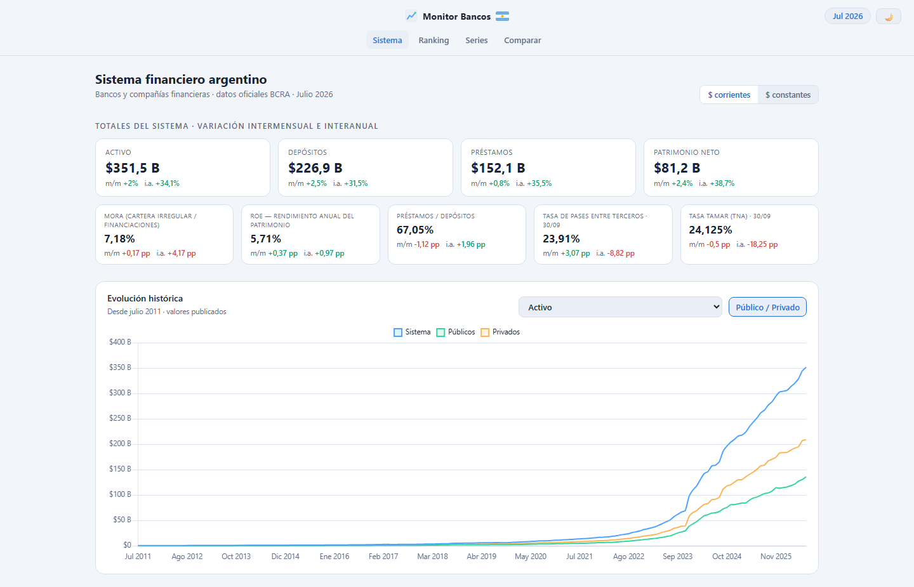
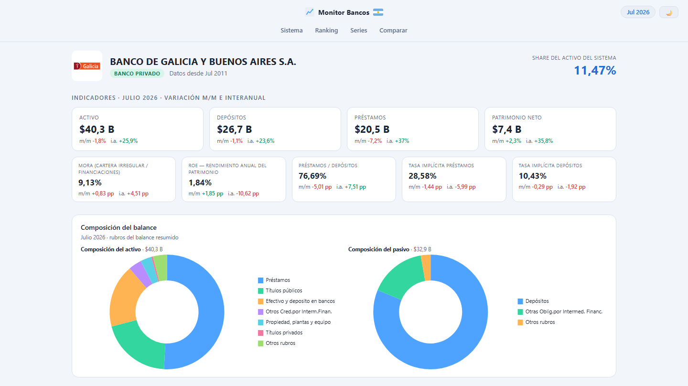
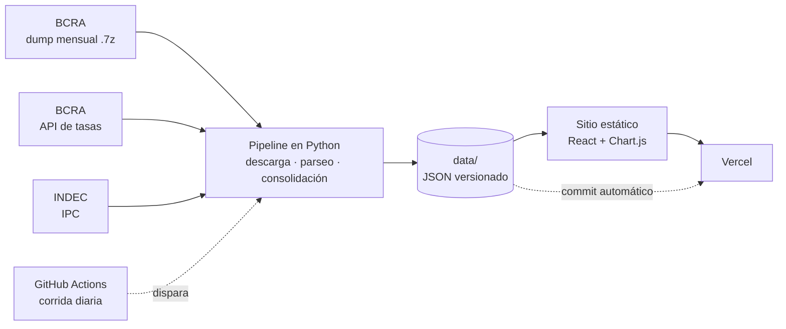

<div align="center">

# Monitor del Sistema Financiero Argentino

**Quince años de balances de todos los bancos argentinos, en un tablero que se actualiza solo.**

[](https://monitorbancos.vercel.app)

[](https://github.com/LToscano27/monitor-bancos/actions/workflows/update.yml)


[](https://monitorbancos.vercel.app)

</div>

## Qué es

El Banco Central publica todos los meses los balances e indicadores de cada entidad
financiera del país, pero en un formato pensado para descargar, no para leer: un archivo
comprimido con cientos de TXT, que cambió de estructura varias veces y que no trae series
históricas armadas.

Este proyecto toma esa información desde julio de 2011, la limpia, la consolida y la
muestra en un sitio donde se puede ver de un vistazo cómo está el sistema, comparar bancos
entre sí y seguir cualquier indicador a lo largo del tiempo.

**→ [monitorbancos.vercel.app](https://monitorbancos.vercel.app)**

## Qué se puede hacer

| | |
|---|---|
| **Sistema** | Activo, depósitos, préstamos y patrimonio del sistema, con su variación mensual e interanual, más mora, rentabilidad y las tasas de mercado del día (TAMAR y pases). |
| **Ranking** | Ordenar todas las entidades por cualquiera de 40 indicadores, en cualquier mes desde 2011, con su participación de mercado. |
| **Series** | La evolución histórica de cualquier indicador para el sistema, los bancos públicos, los privados o una entidad puntual. |
| **Comparar** | Poner hasta seis entidades lado a lado, o un banco contra el promedio del sistema. |
| **Ficha por banco** | Indicadores, composición del balance, evolución e historia institucional de cada entidad. |

<div align="center">

[](https://monitorbancos.vercel.app/#/entidad/00007)

</div>

### Lo que lo distingue

- **Pesos constantes.** Con la inflación argentina, una serie nominal no dice nada. Todos
  los montos se pueden ver deflactados con un IPC empalmado (San Luis → CABA → INDEC) que
  cubre el período completo.
- **Rentabilidad comparable en el tiempo.** Hasta 2019 los balances eran nominales y desde
  2020 se presentan ajustados por inflación, así que el ROE publicado no es comparable
  entre ambos tramos. El sitio ofrece una serie empalmada en términos reales para los
  quince años.
- **Composición del balance mes a mes.** Qué parte del activo son préstamos, títulos
  públicos o efectivo, y cómo fue cambiando. Permite ver, por ejemplo, cómo la exposición
  del sistema al sector público pasó de menos del 7% del activo en 2011 a cerca del 28%.
- **Se mantiene solo.** Un proceso automático revisa a diario si el BCRA publicó un mes
  nuevo, lo procesa y actualiza el sitio sin intervención.

## Cómo funciona



1. **Descarga.** Cada mes el BCRA publica un `.7z` con la información de todas las
   entidades. El pipeline lo baja, verifica que sea un archivo válido y lo extrae.
2. **Parseo.** Se leen los TXT y se llevan a un esquema único de indicadores, cualquiera
   sea el formato del año de origen.
3. **Consolidación.** Se arman las series históricas por entidad y por agrupamiento, las
   fichas de cada banco, la composición del balance y el índice de inflación.
4. **Publicación.** Los datos quedan como JSON versionado dentro del repositorio. El sitio
   es estático y los lee directo: no hay servidor ni base de datos que mantener.

Una acción programada de GitHub repite el ciclo todos los días. Si hay datos nuevos los
guarda en el repositorio, y eso alcanza para que Vercel publique el sitio actualizado.

## Lo que hubo que resolver en los datos

La mayor parte del trabajo estuvo en entender una fuente que no está documentada para este
uso. Algunos de los problemas que el pipeline maneja:

- **El formato cambió con los años.** El archivo principal pasó de 11 a 42 campos, y la
  lista de indicadores cambió antes que el archivo que los contiene: durante casi tres años
  convivieron la estructura vieja con los indicadores nuevos. El formato se detecta por el
  contenido, porque la documentación que acompaña a los archivos viejos está desactualizada.
- **Un mes que no existe no devuelve error.** El servidor responde con una página web en
  lugar de un archivo, así que hay que mirar los primeros bytes para saber si la descarga
  sirve.
- **Meses publicados con datos de otro mes.** Dos archivos traían adentro la información
  del mes anterior. Se comparan la fecha pedida y la fecha interna antes de aceptar un
  período.
- **Bloques de indicadores en cero.** Hay meses en que todos los indicadores figuran en
  cero aunque los montos estén bien. Se tratan como dato faltante y no como un valor.
- **Signo contable en el balance.** Para armar la composición del activo hay que respetar
  el signo de cada cuenta: previsiones y amortizaciones restan. Con eso el activo
  reconstruido difiere menos de 0,5% del total oficial.
- **Meses que el BCRA nunca publicó.** Mayo de 2013, marzo de 2014 y julio de 2020 son
  huecos de la fuente. Las variaciones se calculan por fecha y no por posición para que un
  mes faltante no desplace las comparaciones.

Cada corrida valida que el total del sistema coincida con la suma de las entidades.

## Tecnología

| Capa | Herramientas |
|---|---|
| Datos | Python 3.12, `requests`, `py7zr` |
| Sitio | React 19, TypeScript, Vite, Chart.js |
| Automatización | GitHub Actions |
| Publicación | Vercel |

## Fuentes

- **BCRA — Información de Entidades Financieras.** Balances e indicadores de cada entidad.
- **BCRA — API de Estadísticas Monetarias.** Tasa TAMAR y tasa de pases entre terceros.
- **INDEC, Dirección de Estadística de CABA y de San Luis.** Índices de precios para el
  ajuste por inflación.

Los montos están en miles de pesos. Los indicadores de cada agrupamiento son los que
calcula el BCRA, sin recalcular.

## Correrlo en tu máquina

```bash
# Datos
pip install -r pipeline/requirements.txt
python pipeline/process_period.py 202604   # procesa un mes puntual
python pipeline/update.py                  # trae lo que falte y regenera las series

# Sitio
cd web
npm install
npm run dev                                # http://localhost:5173
```

<details>
<summary>Estructura del repositorio</summary>

```
pipeline/              Descarga, parseo y consolidación
  bcra.py              Descarga y extracción de los archivos del BCRA
  parse.py             Lectura de los TXT y esquema único de indicadores
  process_period.py    Procesa un mes
  backfill.py          Procesa todo el histórico
  build_series.py      Series por entidad y por agrupamiento
  build_meta.py        Fichas de cada banco
  build_composition.py Composición del balance mes a mes
  ipc.py               Índice de inflación empalmado
  tasas_mercado.py     Tasas de mercado desde la API del BCRA
  update.py            Actualización incremental
  sanity_check.py      Controles de calidad del histórico
data/                  Resultados en JSON, versionados
web/                   Sitio (React + TypeScript)
.github/workflows/     Corrida automática diaria
```

</details>

## Aclaración

Este sitio no es una publicación oficial del BCRA ni constituye asesoramiento financiero.
Los datos se muestran tal como los informa la fuente; ante cualquier diferencia vale la
publicación original.

## Autor

**Lautaro Toscano** · [@LToscano27](https://github.com/LToscano27)
